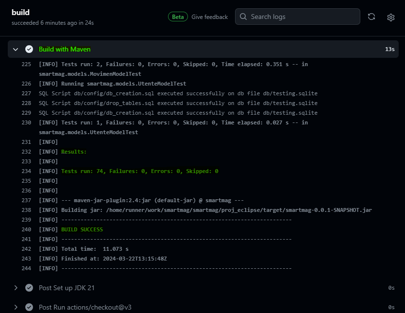

# Introduzione

Progetto per il corso di *Ingegneria del Software*.

Si tratta di un *sistema di gestione di un magazzino*, che permette di svolgere una serie di attività, tra cui:

- Tenere traccia dei depositi e dei prelievi degli articoli, con le relative destinazioni;
- Monitorare le quantità disponibili, con la possibilità di impostare una soglia minima di scorta a magazzino;
- Tenere traccia delle caratteristiche di ogni singolo prodotto.

## Documentazione

Tutta la documentazione del progetto risiede nella cartella `/docs`. Fare riferimento al documento `/docs/README.md` per averne una panoramica.

Nella sezione *Projects* della repo è presente anche la *Kanban board* dove vengono gestiti gli issue/PR e le attività divise in *da fare* | *in corso* | *fatte*.

## Implementazione

Nello specifico, il risultato è un'applicazione desktop GUI sviluppata in Java (*Swing*) che si appoggia ad un database *sqlite* locale.

Il progetto Eclipse con tutti i sorgenti risiede nella cartella `/proj_eclipse`.

## Getting started

Seguire i seguenti passi per importare il progetto nell'IDE Eclipse:

1. Clonare questa repo
2. In Eclipse cliccare *File* > *Importa*, poi *Generale* > *Progetto esistente nel workspace*
3. Selezionare la cartella `/proj_eclipse` che si trova **dentro** quella della repo e importare
4. **IMPORTANTE: Tasto destro sul progetto > *Maven* > *Aggiorna progetto***

Si consiglia poi l'utilizzo della *JDK 21*, la stessa utilizzata durante lo sviluppo e dalla GitHub Action *Java CI with Maven*.

# Documentazione

La documentazione del progetto è stata caricata sulla repo e comprende:

- la cartella `UML` contenente i diagrammi realizzati
- e una serie di file *Markdown* per i vari capitoli della documentazione.

## UML

Nella cartella `UML` si possono trovare i seguenti diagrammi UML:

- Use Case diagram
- Class diagram
- State diagram
- Activity diagram
- Sequence diagram
- Component diagram

Tutti questi vengono raggruppati nel [capitolo del Modeling](#modeling) della documentazione.

## Indice

Innanzitutto menzioniamo il documento del [*Project Plan*](./SmartMag_ProjectPlan.pdf) che è stato consegnato nelle fasi iniziali del nostro progetto.

Oltre a questo, troviamo i vari file dei capitoli della documentazione:

- [Software Lifecycle](#software-life-cycle)
- [Configuration Management](#configuration-management)
- [People Management and Team Organization](#people-management)
- [Software Quality](#software-quality)
- [Requirement Engineering](#requirement-engineering)
- [Modeling](#modeling)
- [Software Architecture](#software-architecture)
- [Software Design](#software-design)
- [Testing](#testing)
- [Software Maintenance](#software-maintenance)

# Software Life Cycle

Come modello di sviluppo, è stato scelto di utilizzare *RAD* (*Rapid Application Develpment*) caratterizzato da:

- _Protoyping:_  
  Lo sviluppo del progetto è stato basato sulla realizzazione di prototipi. In particolare, è stata usata la prototipazione evolutiva, ovvero che dopo
  aver completato il prototipo, quest'ultimo non viene "buttato", ma viene utilizzato come base per realizzare la versione definitiva del software.

- _Utilizzo della tecnica del time boxing:_  
  Lo sviluppo del progetto è stato suddiviso in diverse attività. A ciascuna di queste, è stato dedicato un tempo di realizzazione determinato in base alla complessità del lavoro da svolgere:  
  
  | Time box | Attività                                           |
  | -------- | -------------------------------------------------- |
  | 1        | Organizzazione e scelta del progetto da realizzare |
  | 2        | Project Plan                                       |
  | 3        | Ingegneria dei requisiti                           |
  | 4        | Architettura del software                          |
  | 5        | Design del software                                |
  | 6        | Realizzazione diagrammi UML                        |
  | 7        | Scrittura del codice                               |
  | 8        | Test                                               |

  A loro volta alcune di queste time boxes sono state suddivise in processi più piccoli (come ad esempio la scrittura del codice):
  
  | Time box | Attività                                            |
  | -------- | --------------------------------------------------- |
  | 1        | MAVEN setup                                         |
  | 2        | JOOQ setup and JUnit setup                          |
  | 3        | Realizzare le classi identificate nel class diagram |
  | 4        | Realizzare le classi dei modelli                    |
  | 5        | Realizzare le classi delle view                     |
  | 6        | Integrazione delle diverse parti del codice         |
  | 7        | Scrivere il codice di test                          |

- _Processo di triage:_  
  È stata utilizzata la tecnica *MoSCoW* per assegnare a ciascun requisito una priorità.  
  Grazie al processo di triage, è stato possibile concentrarsi sui requisiti più rilevanti per lo sviluppo del progetto e quindi di sfruttare al meglio il tempo a disposizione. 
    
- _Frequenti riunioni informali:_  
  Queste riunioni hanno avuto lo scopo di mantenere aggiornati i membri del team sullo stato del progetto e di poter condividere idee e opinioni in merito a ciò che si stava sviluppando.
  In particolare, si sono tenute sessioni di *brainstorming*, dove sono emerse molte idee che hanno contribuito allo sviluppo del progetto.
  
- _Pair programming:_  
  Grazie all'utilizzo di strumenti come *CodeTogether* è stato possibile collaborare durante lo sviluppo del codice.  
  È stata utilizzata questa tecnica soprattutto nella realizzazione delle parti di codice più complesse e più impattanti per il progetto.
  
- _Continuos improvement:_  
  Anche durante l'avanzamento del lavoro si sono sempre accettati cambiamenti dei requisiti: spesso è difficile conoscerli a priori e con precisione.
  Grazie ad un software ben strutturato, queste variazioni, non hanno generato dei grossi problemi.

# Configuration Management

Il lavoro svolto è stato supportato in tutto e per tutto dall'utilizzo di *GitHub* e *git* come version controller.  
Infatti è stata creata una repository che permette la condivisione sia della documentazione che del codice.

## Struttura della repository

La repository è composta da due cartelle principali:

- `./docs/`: contiene tutta documentazione (project plan, diagrammi...)
- `./proj_eclipse/`: contiene il codice

## Issues

Nei vari incontri periodici sono stati creati degli *issue* ognuno dei quali contiene la descrizione del compito da svolgere e l’indicazione della persona a cui è stato assegnato.
Gli issues sono stati usati sia per segnalare i problemi (*bug*) che si sono riscontrati che per le aggiunte/modifiche che andrebbero apportate al progetto.

## Utilizzo dei branch

È stata ampiamente utilizzata la funzionalità dei *branch* di *git* che ha permesso ad ognuno di *introdurre modifiche senza interferire con il lavoro altrui* e mantenendo un ramo principale più stabile sul quale, solo successivamente tramite l'approvazione di una *pull request*, andare ad applicare le modifiche introdotte sul ramo secondario.

## Procedura adottata

La gestione delle modifiche/aggiunte all'interno del programma è stata svolta seguendo la procedura:

1. **Apertura di un issue contente la descrizione del problema/modifica**
   
    

2. **Creazione di un branch nel quale apportare le modifiche**

    

1. **Generazione di una Pull Request**

    

1. **Approvazione o richiesta di ulteriori modifiche**

    

2. **Merge nel main dal branch**

3.  **Chiusura del branch**

## Kanban Board

È stata utilizzata una Kanban Board composta da 4 colonne: Todo, In progress, Pending review, Done.  
La Kanban Board è stata utile per monitorare lo stato delle varie attività da svolgere, in particolare per gli issues e le Pull Request.

   

- _Todo:_ contiene gli issues che sono stati generati ma non ancora in elaborazione.
- _In progress:_ contiene gli issues che sono in fase di elaborazione ma non ancora completati.
- _Pending review:_ contiene gli issues che sono in fase di elaborazione ma per cui è richiesto un controllo oppure quando si genera una Pull Request.
- _Done:_ Contiene gli issues che sono stati chiusi e controllati da almeno un membro del team

# People Management

È stato deciso di organizzare il team secondo il modello SWAT (Skilled Workers with Advanced Tools).

All'interno del team non sono stati identificati dei ruoli precisi così da permettere a ciascun membro di partecipare a tutte le attività di sviluppo del progetto.
Questo modo di organizzare il team è stato molto utile, non solo per accrescere le proprie conoscenze relative al progetto, ma anche da un punto di vista tecnico.  
Infatti, una suddivisione equa del lavoro, soprattutto nella fase di sviluppo del codice, ha permesso a ciascun membro di approfondire vari argomenti (come ad esempio l'utilizzo di un DB).

Proprio come una squadra SWAT, sono stati utilizzati canali di comunicazione informali che si possono distinguere in:

- _Comunicazione sincrona:_ sono state organizzate riunioni su *Slack* e su *Discord*
- _Comunicazione asincrona:_ sono stato utilizzati issue/commenti su *GitHub*

Pur non essendo stata fatta una distinzione sul tipo di lavoro assegnato, per procedere più rapidamente con lo sviluppo del progetto, i componenti del team si sono dedicati maggiormente ai campi di cui hanno maggior conoscenza e quindi capacità di esecuzione.

|              | Progettazione software | Progettazione DB | Sviluppo software | Testing | Documentazione |
| ------------ | ---------------------- | ---------------- | ----------------- | ------- | -------------- |
| Davide       |                        | X                | X                 |         | X              |
| Lorenzo      | X                      | X                | X                 | X       |                |
| Massimiliano |                        | X                | X                 | X       |                |

> La tabella precedente evidenzia solo la differenziazione in termini di tempo dedicato ai vari lavori, ma tutti i membri hanno contribuito a ciascuno di essi.

# Software Quality

Per lo sviluppo del progetto sono stati seguiti alcuni dei fattori di qualità definiti da *McCall*:

- _Correttezza:_ Il software soddisfa le specifiche emerse durante la fase di ingegneria dei requisiti.
  In particolare soddisfa quelli con priorità più elevata (identificati mediante la tecnica *MoSCoW* durante il processo di triage).
  Per quanto riguarda i requisiti meno rilevanti, invece, verranno eventualmente implementati in una versione successiva del prototipo.
  
- _Affidabilità:_ Garantita dai test effettuati sul codice, grazie ai quali è stato possibile accertare che il programma svolgesse le funzioni richieste 
  con un certo grado di precisione.

- _Manutenibilità:_ È stato ottenuto un certo livello di manutenibilità grazie all'utilizzo dei *design patterns* che hanno permesso di dare al software una struttura
  che lo rendesse di facile comprensione e di conseguenza, in caso di guasti da risolvere, anche semplice da manutenere.  
  Difatti durante la manutenzione di un software, è molto importante comprenderne il funzionamento.
  A tal proposito è stato utilizzato intensivamente *Javadoc*, in particolare per la descrizione delle funzioni svolte dai metodi presenti all'interno del software.
  
- _Usabilità:_ L'interfaccia grafica che è stata sviluppata è intuitiva e semplice da utilizzare. Questa semplicità di utilizzo è favorita     
  dalla presenza di pulsanti autoesplicativi e da una buona suddivisione in finestre contenenti funzionalità affini.

- _Testabilità:_ Il software che è stato realizzato, pur utilizzando un DB (che potrebbe introdurre difficoltà nella realizzazione dei casi di test), è semplice da testare.
 Quest'ultima è stata ottenuta grazie alla realizzazione di metodi che, invocati al termine dei test, ripuliscono il DB da eventuali modifiche apportate.
 Inoltre nel caso non servisse lavorare su dati già presenti nel DB dell'applicazione, è stata data la possibilità di utilizzare altri DB sui quali effettuare casi di test.

- _Portabilità:_ Il software è stato realizzato nel linguaggio *Java*, il quale garantisce portabilità grazie alla *JVM* (Java Virtual Machine) e al *bytecode*.

- _Flessibilità:_ Il programma è stato sviluppato basandosi su un'architettura ben definita. Un programma ben strutturato è anche semplice da modificare.

 - _Riutilizzabilità:_ Il software è stato sviluppato sull'architettura *MVC* (Model View Controller), il che gli ha conferito un certo livello di *modularità* e che permette al programma di poter essere riutilizzato in maniera semplice. Ad esempio, si potrebbe realizzare un applicativo client/server con interfaccia web riutilizzando i modelli già sviluppati, senza preoccuparsi di business logic e persistenza dati!
  
# Requirement engineering

## Elicitazione dei requisiti

In questa fase è stato fondamentale confrontarsi con persone che hanno lavorato nel settore della logistica.
Per riuscire ad ottenere tutte le informazioni necessarie alla realizzazione del sistema sono state usate le seguenti tecniche di elicitazione dei requisiti:

- __Intervistare/chiedere:__

  Sono state organizzate delle riunioni, nelle quali, mediante la tecnica del brainstorming, è stato possibile identificare alcuni dei requisiti     
  necessari allo sviluppo del sistema.  
  La sessione di brainstorming è stata suddivisa in due fasi principali:
  - La prima aveva l'obiettivo di generare il maggior numero possibile di idee.
  - La seconda,invece, di selezionare tra le idee generate quelle più utili alla realizzazione del sistema finale.
  
- __Analisi delle attività:__
  
  Sono state analizzate le varie attività che il personale di un magazzino deve svolgere nel corso della giornata lavorativa.  
  Da questa analisi è stato possibile definire i seguenti "attori" e i relativi compiti:
  
  - _Magazziniere:_
    
    Movimenta i prodotti da una locazione all’altra, preleva il prodotto, verifica la disponibilità e la locazione del prodotto mediante il suo codice.
    Altresì deve avere la possibilità di modificare le quantità di prodotti a magazzino.
    
  - _Magazzinieri qualificati:_

    Oltre all'attività di magazziniere può anche accettare o rifiutare i rifornimenti.
    
  - _Responsabile ordini:_
  
    Genera gli ordini di prelievo e deposito prodotti nel magazzino. Ha modo di ottenere la lista dei prodotti con rimanenze sottosoglia.    
    Inoltre ha la possibilità di visionare le statistiche riguardanti il magazzino.
    
  - _Manager magazzino:_

    Gestisce il personale: stabilisce ruoli, definisce gli utenti e genera le statistiche lavorative sul personale. Ha accesso alle informazioni di accounting (storico).
    Gestisce i prodotti (aggiunta di nuovi, rimozione, etc.) e li assegna ai box.

  - _Sistema informativo:_
  
    Quando le rimanenze di prodotto scendono sotto una certa soglia, invia una notifica al responsabile ordini se non ha già provveduto al riordino.
    Gestisce l'accounting: storico degli spostamenti/modifiche prodotti. 

- __Analisi degli scenari:__
 
  È stato molto utile ascoltare i racconti dei lavoratori nel settore della logistica riguardanti alcune delle situazioni che si sono presentate 
  nel corso della loro esperienza lavorativa. Grazie a queste testimonianze è stato possibile elicitare quei requisiti che solo chi ha lavorato nel settore logistico è in grado di fornire.

- __Derivazione da sistema esistente:__
  
  Poiché la fase di elicitazione dei requisiti si è basata in gran parte sull’esperienza dei lavoratori nel settore logistico, inevitabilmente   
  alcune delle funzionalità implementate nel progetto derivano da sistemi già esistenti.

## Specifica dei requisiti

1. Il magazzino deve essere composto da:
    - Corsie: identificate da una o più lettere.
    - Scaffali: una corsia può contenere sia uno scaffale a sinistra che uno a destra.
    - Slot: gli scaffali sono divisi in slot. Per gli scaffali a sinistra, il numero dello slot è dispari, mentre per quelli a destra, il numero   
      dello slot è pari.
    - Piani: uno slot è suddiviso in piani, ognuno dei quali è identificato da un numero intero
    - Box: identifica la locazione di un prodotto ed è dato dall'insieme delle parti che costituiscono il magazzino elencate sopra.

   Ecco un esempio di come dovrà essere gestita una corsia all'interno di SmartMag:

    
    
2. Per accedere al software è richiesto il log-in dell'utente, dove andranno inseriti Matricola e password.
  
3. Il manager, si dovrà occupare della gestione del personale. Egli dovrà poter:
   1. Creare gli utenti di tutto il personale inserendo: matricola, nome, cognome, ruolo, password.
   2. Accedere alla lista dei prodotti presenti a magazzino
   3. Aggiungere o rimuovere prodotti nel magazzino
   4. Assegnare un box ed una quantità a ciascun prodotto
   5. Modificare le quantità dei prodotti

4. Il responsabile ordini si occupa della gestione degli ordini. Egli dovrà poter:
   1. Accedere alla lista dei prodotti presenti a magazzino
   2. Accedere alla lista degli ordini
   3. Aggiungere e rimuovere un ordine
   4. Inserire un ordine manualmente
   5. Inserire un ordine da file
   6. Modificare un ordine se è in stato di attesa e non sono ancora state generate le relative movimentazioni
   7. Approvare le movimentazioni proposte dal sistema in seguito all'inserimento dell'ordine

5. Le movimentazioni devono essere generate dal sistema a seguito dell'approvazione da parte del responsabile ordini.
   1. Per ogni prodotto presente nell'ordine deve essere generata una o più movimentazione.
   2. La movimentazione deve specificare: l'ordine, il prodotto, l'origine, la destinazione, lo stato e il magazziniere che l'ha presa in carico.
   3. La movimentazione deve contenere anche la data di completamento per l'accounting.

 6. Se il magazziniere dopo aver preso in carico una movimentazione, si accorge che le quantità richieste non sono presenti nel box:
    1. Deve poter aggiornare la quantità di prodotto nel box
    2. Il sistema verifica se è presente la quantità richiesta in altri box
    3. Se la quantità richiesta è disponibile in un altro box, genera una nuova movimentazione
    4. Se la quantità richiesta non è presente a magazzino, annulla la movimentazione e riporta lo stato dell'ordine in "attesa".
    
  7. Il responsabile ordini, a fronte di disponibilità limitate di certi prodotti, può effettuare richieste di acquisto, 
     specificando le quantità di rifornimento per i vari prodotti coinvolti.

  8. Alla consegna dei rifornimenti, il magazziniere qualificato verifica che quanto ordinato corrisponde al carico ricevuto.
     1. Se i prodotti ricevuti corrispondono all'ordine, accetta la consegna e fà generare al sistema le movimentazioni.
     2. Nel caso in cui sia arrivato prodotto non ancora assegnato ad un box, il sistema ne sceglie uno in automatico.
     3. Se i prodotti ricevuti non corrispondono all'ordine, lo stato dell'ordine non cambia e rimane "in attesa".
    
  9. Quando un magazziniere prende in carico una movimentazione, lo stato di quest'ultima passa da "in attesa" a "presa in carico".
     Quando un magazziniere preleva il prodotto dal box, lo stato della movimentazione passa da "presa in carico" a "prelevata".
     Una volta posizionato il carico nell'opportuna destinazione, lo stato della movimentazione viene aggiornato in "completata".
     
  10. Quando un prodotto nel box scende sotto la soglia impostata, il sistema invia un suggerimento di riordino al responsabile di magazzino. 

## MoSCoW - negoziazione dei requisiti

I requisiti del progetto, sono stati inseriti all'interno della seguente tabella in base alla loro priorità applicando la tecnica MoSCoW:

| Must have                   | Should have      | Could have       | Won't have |
|-----------------------------|------------------|------------------|------------|
|    1                        |      3.5         |     8.2          |    4.5     |
|    2                        |      4.6         |  6.2 - 6.3 - 6.4 |   4.7      |
|    3.1 - 3.2 - 3.3 - 3.4    |      8.1 - 8.2   |                  |    5.3     |
|    4.1 - 4.2 - 4.3 - 4.4    |                  |                  |     10     |
|    5.1 - 5.2                |                  |                  |            |
|    6.1                      |                  |                  |            |
|    7                        |                  |                  |            |
|    9                        |                  |                  |            |

Durante la fase di negoziazione è stata decisa l'assegnazione dei requisiti nella tabella mostrata sopra.

# Modeling

Per lo sviluppo del progetto una fase importante è stata quella della modellazione. Attraverso l'uso dei diagrammi UML siamo stati in grado di definire e strutturare diversi aspetti del sistema molto delicati in modo chiaro e organizzato. In particolare sono stati utilizzati e verranno discussi i seguenti modelli:

- Use Case Diagram
- Class Diagram
- Activity Diagram
- State Diagram

## Use Case Diagram

In questo diagramma sono state rappresentate le funzionalità messe a disposizione degli attori coinvolti, in particolare possiamo individuare quattro attori umani:

1. **Manager di magazzino**:
Si occupa di inserire nel sistema i dati di nuovi utenti, prodotti e box (anche se per quest'ultimo si é poi deciso di realizzarne la creazione solo all'inserimento del prodotto nel box) potrà inoltre, nelle versioni future del sistema,  visionare le informazioni e le statistiche dei vari magazzinieri.
2. **Responsabile ordini**:
Ha la possibilità di inserire e cambiare lo stato dei diversi ordini
3. **Magazziniere**:
Il suo unico scopo é quello di spostare i prodotti all'interno del magazzino e segnalare l'avvenuto prelievo e spostamento del prodotto
4. **Magazziniere qualificato**:
Un estensione del magazziniere, é abilitato al controllo e accettazione degli ordini in ingresso

Questi 4 attori estendono l'utente in quanto tutti devono effettuare l'accesso al sistema per poter controllare le informazioni relative ai prodotti o registrare il proprio lavoro. 
Infine l'ultimo attore é il sistema informatico stesso che analizzando le disponibilità e i box del magazzino genera le movimentazioni da effettuare.

## Class Diagram

Nel seguente diagramma delle classi sono indicate ad un livello piu specifico tutte le varie classi e le loro relazioni ed é stato infatti utilizzato come scheletro per lo sviluppo del codice. 
Sono tuttavia presenti alcune differenze, durante lo sviluppo é stato infatti deciso di non creare diverse classi per i diversi tipi di utente ma di aggiungere un attributo "*TipoUtente*" alla classe Utente che non é quindi stata realizzata come astratta.

## Activity Diagram

In questo diagramma viene mostrata la sequenza di operazioni che il magazziniere e il sistema svolgono per gestire una movimentazione e più in generale la lista di movimentazioni.

## State Diagram

Abbiamo creato un diagramma di stato per rappresentare le varie fasi della giornata lavorativa di un magazziniere. Il diagramma identifica due stati principali:

1. **Fuori turno**: Indica quando il magazziniere è in pausa o ha terminato il turno.
2. **In turno**: Rappresenta il momento in cui il magazziniere è attivo e sta svolgendo le proprie mansioni. Inizialmente si trova nello stato **senza movimentazione assegnata**.

All'interno dello stato "senza movimentazione assegnata", il magazziniere si sposta in una serie di stati:

- Controlla la disponibilità di movimentazioni da svolgere.
- Se sono presenti movimentazioni in entrata, si dirige verso la zona di carico/scarico.
- Se le movimentazioni sono in uscita, si sposta nella zona dei box.
- Segna il prodotto come prelevato e lo sposta nella zona corretta.
- Deposita il prodotto e aggiorna lo stato della movimentazione a "completato".

Dopo aver completato queste azioni, il magazziniere ritorna allo stato "senza movimentazione assegnata" per continuare con le sue attività.

## Sequence Diagram

Col *diagramma di sequenza* siamo andati a modellare la sequenza di interazioni tra il *Responsabile Ordini*, *Magazziniere Qualificato* e il *Modello degli Ordini* volte alla creazione e gestione degli ordini.

Principalmente si denota ovviamente il ruolo principale del *Responsabile Ordini* nella gestione degli ordini. In particolare, una volta creato e prima di essere approvato, un ordine può essere cancellato o eventualmente modificato più volte solo se si tratta di un ordine in uscita. Un ordine poi può essere approvato: se si tratta di un rifornimento (`IN`) deve essere approvato da un *Magazziniere Qualificato* alla consegna delle merci ordinate, se invece si tratta di un ordine commissionato (`OUT`) deve essere approvato dal *Responsabile Ordini* e in questo caso il sistema si assicura che sia preparabile controllando le disponibilità. All'approvazione, il modello genera le movimentazioni, cambia lo stato dell'ordine e, una volta completate tutte le movimentazioni, lo contrassegna come completato.

# Software Architecture

## Introduzione

Il software é stato sviluppato seguendo un'architettura modulare basata sul pattern Model-View-Controller, in cui i due moduli view e controller sono stati accorpati in quanto fortemente legati; questa andrà ad interfacciarsi, attraverso l'utilizzo di jOOQ, con un database creato usando SQlite. La connessione al database SQLite è gestita da un componente  che si trova nel package `smartmag.db`, il quale fornisce un'interfaccia per stabilire e gestire la connessione (unica) con il database, garantendo l'integrità e la persistenza dei dati.

## Modello

Il modello rappresenta i dati e la business logic dell'applicazione. Nel contesto del nostro software ciò é gestito da due package:

1. **Package `smartmag.data`**: Contiene le classi che gestiscono i dati delle singole entità su cui lavoreranno i vari modelli del sistema.

2. **Package `smartmag.models`**: Contiene i modelli (Mvc) delle varie entità, uno per ciascuna classe presente nel package precedente. Ogni modello, ha due attributi principali: un'istanza di una delle suddette classi contenenti i dati dell'entità e un record corrispondente (messo a disposizione da jOOQ) che permette la sincronizzazione con il database. In queste classi sono definite tutti i metodi che vanno effettivamente a fornire le funzionalità del sistema, modificando i dati degli oggetti gestiti.

## Vista e Controller

Le Viste e i Controller sono combinati insieme nel package **`smartmag.ui`** il quale gestisce l'interfaccia utente e le interazioni dell'utente con il sistema. Questa parte del software richiama i metodi dei modelli per consentire all'utente di interagire con i dati del database. Inoltre, le viste vengono notificate dai modelli ad ogni modifica dei dati.

## Conclusioni

L'architettura del software per la gestione del magazzino è stata progettata con l'obiettivo di garantire un'organizzazione chiara e una gestione efficiente dei dati. L'implementazione del pattern MVC, con il Controller integrato insieme alla View, contribuisce a conferire modularità alla struttura del sistema, facilitando lo sviluppo e la manutenzione del software.

# Software Design

## Pattern MVC

Al fine di fornire una certa *modularità* al sistema sviluppato, abbiamo deciso di implementare il *pattern MVC* per lo sviluppo dell'applicazione.
L'applicazione infatti è stata scomposta in tre componenti principali: *Model*, *View* e *Controller*.
A livello di codice, *view e controller sono stati accorpati* nelle stesse classi, questo a causa della forte correlazione tra i due.

- *Model*: contiene i metodi che permettono l'accesso ai dati nel database e implementa la business logic del software.
- *View*: si occupa di visualizzare i dati e gestisce le interazioni con l'utente.
- *Controller*: si occupa di ricevere i comandi dell'utente nella view e tradurle in azioni attraverso le funzionalità messe a disposizione dal modello.

### Ruolo chiave dei modelli

I modelli costituiscono la parte più importante del sistema, effettuando i dovuti controlli sulle azioni intraprese dall'utente e assicurando l'integrità dei dati che vengono poi resi persistenti sincronizzandoli nel database. Per questo abbiamo scelto di realizzare i casi di test su di essi.

## Altri design pattern utilizzati

### Singleton pattern

Questo pattern è stato molto utile per tutte le classi in cui si voleva avere un'unica istanza.  
Nel progetto è stato utilizzato per:

- _Modelli:_ le istanze dei modelli sono uniche. Questo perché più view potrebbero necessitare di uno stesso modello, pertanto se esiste una sola
  istanza di quel modello, tutte le view si riferiscono ad essa.
  Avere più istanze dei modelli porterebbe dei problemi a livello di gestione dei dati e di aggiornamento delle viste.
  
- _DB:_ la connessione è unica, non possono essere create più istanze di connessioni con esso. In questo modo tutti i modelli lavorano sulla stessa istanza di connessione con il database.

### Observer pattern

È stato utilizzato questo pattern per ridurre l'interconnessione tra i modelli e la view.
Facendo in questo modo, è stato possibile svincolare i modelli dalle view, così in futuro se si vorrà aggiornare la UI del sistema sarà possibile farlo mantenendo inalterati i modelli.
Ciascun modello (Observable) contiene una lista di observer, i quali ricevono una notifica ad ogni modifica dei dati.
Ogni view (Observer) è stata registrata al relativo modello per ricevere le notifiche in caso di aggiornamenti.

## Misurazione del codice

### JDepend

Per misurare le metriche indicate nella tabella seguente e valutare così la qualità della progettazione del software, abbiamo fatto ricorso a *JDepend*.  
Dalla tabella si può notare che il livello di astrazione del software è generalmente basso. Per aumentare questo valore, si dovrà effettuare del refactoring in fase di manutenzione.

| Package            | CC | AC | Ca(afferente) | Ce(efferente)  | Astrazione | Instabilità |
|--------------------|----|----|---------------|----------------|------------|-------------|
| Smartmag.data      | 10 | 0  | 4             | 2              | 0.00       | 0.33        |
| Smartmag.db        | 1  | 0  | 2             | 3              | 0.00       | 0.60        |            
| Smartmag.db.utils  | 0  | 1  | 0             | 2              | 1.00       | 1.00        |
| Smartmag.models    | 6  | 1  | 4             | 9              | 0.14       | 0.69        |
| Smartmag.models.ui | 6  | 0  | 1             | 2              | 0.00       | 0.66        |
| Smartmag.ui        | 59 | 0  | 1             | 7              | 0.00       | 0.87        |
| Smartmag.utils     | 1  | 2  | 2             | 3              | 0.66       | 0.60        |

Dove:
- CC: classi concrete
- AC: classi astratte
- Ca: accoppiamento afferente
- Ce: accoppiamento efferente

### Structure101

Per avere un'ulteriore valutazione sulle dipendenze delle classi e dei pacchetti, abbiamo utilizzato *Structure101*.  
Principalmente sono state valutate le classi contenute nei pacchetti e quindi il loro livello di coesione e la presenza di loop.

- Package `data`:  
  Non sono emersi loop all'interno di questo pacchetto e la coesione tra le classi sembra essere molto elevata:

  

- Package `models`:  
  E' emersa la presenza di un loop all'interno di questo pacchetto:

  

- Package `ui`:  
  E' emersa la presenza di un loop (molto semplice da correggere) all'interno di questo pacchetto:
  
  

Riuscire a identificare questi loop è molto importante per poter sistemare il codice in modo tale da renderne la struttura più solida e facile da manutenere.

# Testing

Abbiamo creato dei *casi di test* con *JUnit 5* per esaminare la maggior parte delle funzionalità del sistema.
L'obiettivò è individuare il maggior numero possibile di *difetti* (*bug*) durante la fase di build. Ciò viene fatto in vari modi: invocando le funzionalità da testare con parametri non validi, utilizzandole in contesti in cui non dovrebbe essere permesso o semplicemente simulando scenari e sequenze di azioni che riflettono l'uso tipico dell'applicazione.

## Focus sui modelli

In particolare, abbiamo deciso di concentrare la nostra attività di testing sui *modelli* (MVC) in quanto ricoprono un ruolo chiave nel sistema sviluppato:

- implementano la *business logic*;
- espongono le *interfacce* attraverso cui è effettivamente possibile *svolgere operazioni sui dati* gestiti;
- garantiscono l'*integrità dei dati* e la *persistenza* degli stessi.

### Gestione dei record DB utilizzati dai casi di test

Dato che la maggior parte dei modelli opera su record esistenti e non abbiamo un controllo diretto sull'ordine di esecuzione dei test, abbiamo deciso di adottare i seguenti criteri:

- ogni caso di test *NON deve fare affidamento sulla presenza di record* già salvati a DB;
- ogni caso di test *deve creare TUTTI i record a lui necessari* per ricreare lo scenario sotto esame.

In sintesi, **l'esecuzione di un caso di test non deve influenzare in alcun modo quella degli altri**.

Per implementare i principi scelti, abbiamo adottato la seguente strategia: **prima di eseguire ogni caso di test, svuotiamo il database dedicato e, una volta terminati tutti i test, ne cancelliamo il file**. Questo ci assicura che ogni caso di test sia indipendente dagli altri. Ogni test ha il compito di creare i record necessari (attraverso i modelli) e di effettuare i controlli appropriati, senza preoccuparsi dell’ordine di esecuzione. **Questo approccio aumenta l’affidabilità ed l’efficacia dei nostri test**.

## Numeri

Abbiamo realizzato in totale *74 casi di test* che interessano circa l'*80% del codice* dei modelli.

## Maven e GitHub Action per la Continuous Integration

Abbiamo configurato *JUnit 5* attraverso il `pom.xml` in modo tale che vengano 
eseguiti tutti gli unit test presenti nel progetto durante le build di *Maven*.

Configurando poi ad-hoc una *GitHub Action*
(vedasi `/.github/workflows/maven.yml`), abbiamo ottenuto un workflow di 
*Continuous Integration* il quale esegue in ambiente cloud "sterile" le build *Maven*, **test compresi**, ad ogni PR/push sul branch _main_. Questo *si integra al meglio nella gestione delle pull request* (mostrando l'esito delle build) e costituisce un *ottimo feedback* sui risultati dei test, indipendentemente dallo stato dell'ambiente di sviluppo utilizzato.

# Software Maintenance

Durante il ciclo di sviluppo del software l'attenzione dedicata alla manutenzione è cruciale per garantire la solidità e l'efficacia del sistema. In questo contesto, abbiamo condotto una serie di interventi mirati attraverso due fasi distintive di manutenzione.

Nella prima fase, ci siamo concentrati sul refactoring, una pratica essenziale per migliorare la struttura interna del codice. Abbiamo rimosso metodi superflui, ottimizzato quelli esistenti e modificato le visibilità dei metodi per garantire una più efficiente gestione delle funzionalità. Questo approccio ha contribuito a rendere il software più snello, maneggevole e preparato ad affrontare futuri sviluppi.

Successivamente, durante la seconda fase di manutenzione, siamo intervenuti in risposta alle segnalazioni emerse dai test eseguiti sul sistema. Questi test hanno rivelato alcune problematiche che sono state individuate e risolte, garantendo un miglioramento della stabilità del software.

In aggiunta all'ottimizzazione del codice, abbiamo posto particolare attenzione sulla documentazione, considerandola fondamentale per agevolare le future manutenzioni. Una documentazione chiara e dettagliata fornisce un importante punto di riferimento per gli sviluppatori, consentendo di comprendere rapidamente il funzionamento del sistema e facilitando eventuali interventi di correzione o miglioramento.

Attraverso queste fasi di manutenzione e il nostro impegno per una documentazione completa, ci assicuriamo che il software non solo soddisfi le esigenze attuali, ma sia anche pronto a evolvere e adattarsi a richieste future da parte degli utenti.

