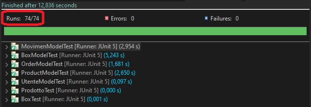
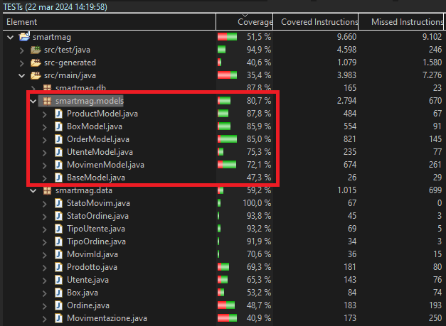
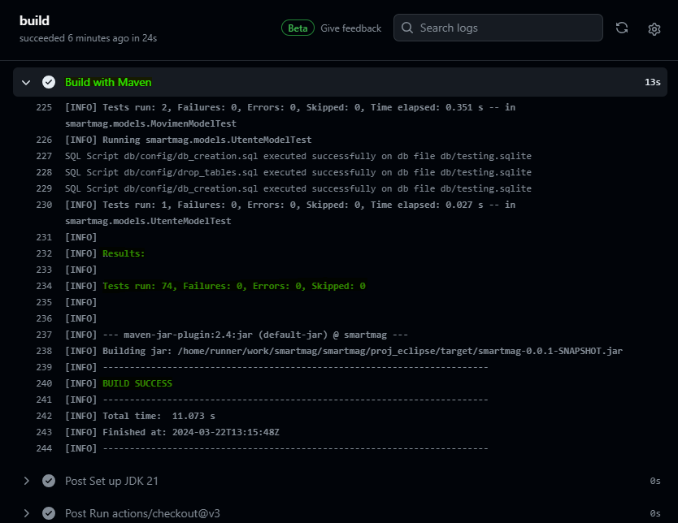
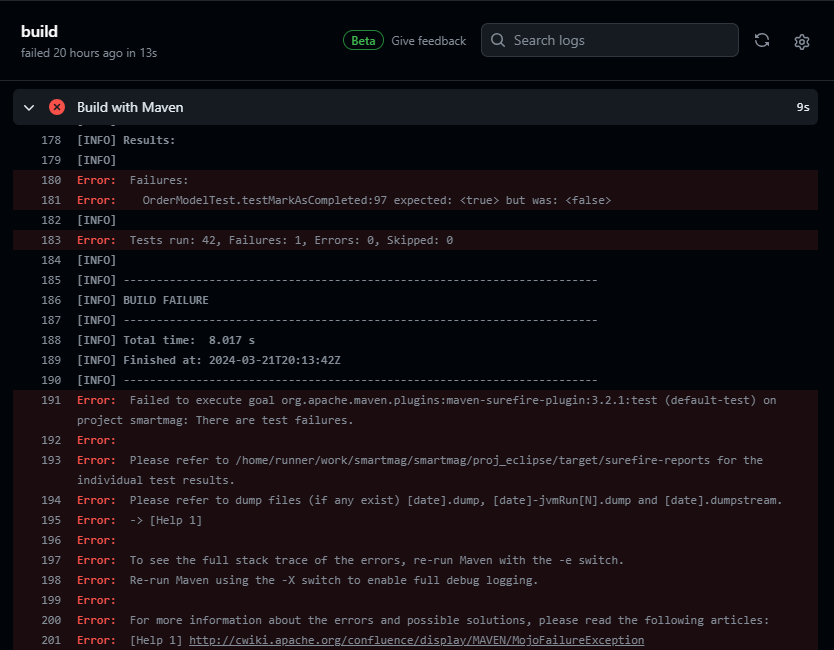

# Unit testing

Abbiamo definito dei *casi di test* con *JUnit 5* che vanno a testare gran parte delle funzionalità del sistema, al fine di scovare in fase di build quanti più *difetti* (*bug*) possibili tentando di scatenare *malfunzionamenti* attraverso l'invocazione delle funzionalità da testare con parametri non validi, in situazioni che non dovrebbero ammetterne l'utilizzo o semplicemente simulando scenari e sequenze di azioni verosimili al funzionamento canonico dell'applicativo.

## Focus sui modelli

In particolare, abbiamo deciso di concentrare la nostra attività di testing sui *modelli* (MVC) in quanto ricoprono un ruolo chiave nel sistema sviluppato:
- implementano la *business logic*;
- espongono le *interfacce* attraverso cui è effettivamente possibile *svolgere operazioni sui dati* gestiti;
- garantiscono l'*integrità dei dati* e la *persistenza* degli stessi.

### Gestione dei record DB utilizzati dai casi di test

Dovendo gran parte dei modelli lavorare su record esistenti e non avendo controllo diretto sull'ordine di esecuzione dei casi di test, che in ogni caso sarebbe di difficile gestione e inutile complessità, abbiamo deciso di procedere nel seguente modo:
- ogni caso di test *NON deve fare affidamento sulla presenza di record* già salvati a DB;
- ogni caso di test *deve creare TUTTI i record a lui necessari* per ricreare lo scenario sotto esame.

In sintesi, **l'esecuzione di un caso di test non deve influenzare in alcun modo quella degli altri**.

Per attuare questi principi scelti, abbiamo fatto in modo di **svuotare il database apposito, prima dell'esecuzione di ciascun caso di test, e di cancellarne il file dopo averli eseguiti tutti**. In questo modo, si ha la certezza che ogni caso di test sia indipendente dagli altri e sarà compito di ognuno di essi andare a creare (attraverso i modelli) tutti i vari record che gli servono e a fare i controlli opportuni, senza preoccuparsi dell'ordine in cui verranno eseguiti. **Questo garantisce una maggior affidabilità ed efficacia dei casi test**.

## Numeri

Abbiamo realizzato in totale *74 casi di test* che interessano circa l'*80% del codice* dei modelli.

## Maven e GitHub Action per la Continuous Integration

Abbiamo configurato *JUnit 5* attraverso il `pom.xml` in modo tale che vengano 
eseguiti tutti gli unit test presenti nel progetto durante le build di *Maven*.

Configurando poi ad-hoc una *GitHub Action*
(vedasi `/.github/workflows/maven.yml`), abbiamo ottenuto un workflow di 
*Continuous Integration* il quale esegue in ambiente cloud "sterile" le build *Maven*, **test compresi**, ad ogni PR/push sul branch _main_. Questo *si integra al meglio nella gestione delle pull request* (mostrando l'esito delle build) e costituisce un *ottimo feedback* sui risultati dei test, indipendentemente dallo stato dell'ambiente di sviluppo utilizzato.

